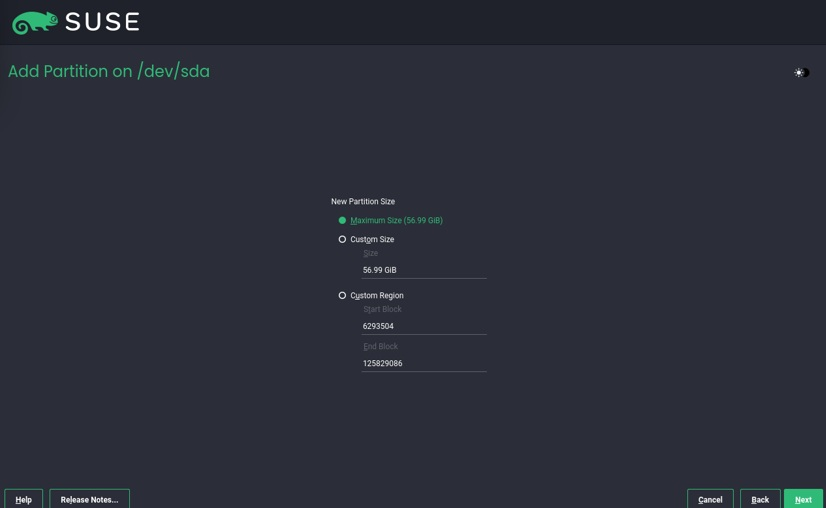

# SUSE 15 安裝示範

## 步驟 1：下載安裝檔

前往 SUSE 官網，下載對應硬體設備之安裝檔。

本次教學以下載15 SP7為例

接下來準備開始安裝虛擬機

---

## 步驟 2：安裝virtual box與建立VM

### 安裝virtual box

將SUSE安裝在VM之前我們必須在實體機器上創建一台VM

◎ 本次安裝VM設置為(CPUS：2 / RAM：4196MB / Disk：60GB)

本次選用Virtual Box來進行安裝

並依照電腦系統安裝正確的安裝包

然後直接打開安裝包

接下來三張圖直接點選下一步

接下來兩步皆點擊是

即可正式進入virtual box的介面

### 建立VM

點擊新增(N)

填寫此VM的基本資料

依照我們對VM的配置填入正確的設定

如此一來VM即設置完成

### 安裝SUSE

接下來要將SUSE系統裝入虛擬機內

在虛擬機上點擊設定並進入存儲裝置 點擊控制器:IDE 點擊空的

並在右側的光碟機choose a disk file

找出安裝的SUSE檔

便可以打開VM正式為其安裝SUSE

接下來只需要照著以下幾張圖片進行就可以

點選SUSE Linux Enterprise Sever 15 SP7

同意後點next

skip registration

自行選擇要不要額外裝設

next

minimal

expert partitioner----->start with correct proposal

將sda1-sda4全數刪除

照下列步驟自行設置

設置時區

skip the creation

設密碼

---

## 步驟 3：

## 2.network
2-1 DHCP

打開 Yast→ 選擇 System → Network Settings

輸入指令確認有無連上網路

2-2 static IP

輸入vim /etc/sysconfig/network/ifcfg-eth0

調整內容

BOOTPROTO='static'

STARTMODE='auto'

IPADDR='192.168.1.100/24'

GATEWAY='192.168.1.1'

NAME='eth0'

2-3 show ip, subnet mask, routing/gate way

查看 IP----->使用ip a

查看 gateway----->ip route

查詢Subnet Mask---->輸入ip addr

2-4 2 vm access each other

## 3.setup ssh server and access it

3-1 enable ssh server

照以下順序輸入指令

1.zypper in openssh   2.systemctl start sshd  3.systemctl enable sshd  4.systemctl status sshd

最後若出現Active: active (running) 這樣就代表你已成功啟動 SSH Server

3-2 setup firewall

依序輸入

1.firewall-cmd --permanent --add-service=ssh

2.firewall-cmd --reload

3.firewall-cmd --list-all

## 4.change hostname

1.開啟yast

2.選擇 System → Network Settings

3.修改Hostname欄位並儲存

## 5.repo & package

5-1 setup DVD or image iso repo

使用zypper ar file:///mnt/.....  名稱可以自己決定

再用zypper lr  檢查是否新增成功

5-2 install mlocate, apache

回到 YaST 主畫面，選擇：Software Management

搜尋 mlocate → 勾選並安裝

搜尋 apache2 → 勾選並安裝

按Accept開始安裝

5-3 find package to include /usr/bin/chsh

輸入zypper wp /usr/bin/chsh

5-4 list all file in mlocate

## 6.user management

6-1 create user account

使用useradd [-s /bin/bash] [-m] user1

使用passwd user1設定密碼

6-2 user join to wheel group

使用usermod -aG wheel user1 將成員加入群組

可用cat /etc/group查看系統有哪些群組

使用id user1便能確認user1有哪些群組

6-3 force change user password when next login

使用以下指令(chage [option] newuser)

-d LAST_DAY: 設定上次密碼變更的日期

若輸入chage -d 0 student01

會把「上次變更密碼」設定成 0 系統會強迫該使用者下次登入時重設密碼

## 7.sudo

7-1 wheel group could run all commonad

使用visudo指令進入vi編輯模式

在字串中找到   # %wheel ALL=(ALL) ALL

把# 刪掉變成%wheel ALL=(ALL) ALL

要離開vi編輯模式只需按下 Esc -----> 輸入 :wq 然後按 Enter

輸入usermod -aG wheel user1

## 8.ssh

8-1. generate ssh key

使用ssh-keygen 產生一組金鑰

會出現下代碼 代表已經產生公鑰與私鑰

8-2. ssh login without password

使用ssh-copy-id user1@VM1的ip 目的是複製公鑰到遠端伺服器

再次輸入ssh user1@VM1的ip，就不需要輸入密碼了

8-3. file transfer by sftp

創建文字檔方法見10-1

我們要傳送一名為hello.txt的檔案

使用sftp user1@127.0.0.1

目的是用 SFTP 傳檔工具，登入「user1」帳號在 127.0.0.1（也就是自己的機器）上。

用put hello.txt把你現在這台電腦上的 hello.txt上傳到遠端使用者 user1 的家目錄

輸入ls後即可看到hello.txt

輸入exit後即可跳出sftp模式

8-4. file transfer by scp

scp hello.txt user2@127.0.0.1:~/.

目的是從目前使用者（本機）將檔案 hello.txt 傳送到同一台機器上 user2 使用者的家目錄 (~) 中。

這樣就完成了

## 9.screen

9-1. create screen with session name

使用screen [-S session_name]指令 可以順便命名(此處命名為hw)

9-2. create & switch window

建立新視窗:Ctrl + a 然後按 c

Ctrl+a 然後按 '    可以切換 window

Ctrl + a 然後按 "  可以列出所有視窗清單

9-3. deattach & re-attach screen

使用Ctrl + a 然後按 d來離線

會顯示:detached from xxxx.hw

使用screen -r hw可以重新連線

9-4. split vertical & horizontal screen

Ctrl+a 然後按 S     # 建立新區域 (水平分割)
Ctrl+a 然後按 |     # 建立新區域 (垂直分割)

9-5. setup caption & hardstatus*

輸入vim ~/.screenrc

加入這些設定：

caption always "%{= kw}Window %n: %t"

hardstatus alwayslastline "%{= kG}[%n] %t %H"

儲存後，下次開啟 screen 就會自動載入這些設定。

## 10.vim

10-1. create text file "Hello Vim!"

輸入vim hello.txt來建立一個檔案

按i進入插入模式並輸入：Hello Vim!

按 Esc 回到一般模式並輸入 :wq 存檔並離開

10-2. split vertical & horizontal screen

水平分割：輸入:split hello.txt

垂直分割：:vsplit hello.txt

10-3. go to normal mode, insert mode, command mode, visual mode

Normal Mode:預設模式，按 Esc 回到一般模式

Insert Mode:按i

Command-Line Mode:按 : 進入

Visual Mode按 v：進入文字選取模式,按 V：選取整行,按 Ctrl-v：選取區塊

10-4. on-line help

在 Vim 中輸入：:help

也能指定特定主題的幫助

:help insert

:help visual

:help write

10-5. compare file

先創立兩個檔案(file1 file2)並用vim編輯

輸入vimdiff file1.txt file2.txt 即可對兩個檔案進行比較

# part2

## 1.process

1-1. explain ps aux command all field

此指令能列出目前系統中所有的行程資訊（process），每一列就是一個行程。

|  欄位名稱   | 說明  |
|  ----  | ----  |
| USER | 該行程的擁有者（哪個使用者啟動的) |
| PID | 行程的唯一 ID（Process ID) |
| %CPU | 行程使用的 CPU 百分比 |
| %MEM |	行程使用的記憶體百分比 |
| VSZ |	虛擬記憶體大小（單位 KB) |
| RSS |	實體記憶體使用量（常駐記憶體，單位 KB) |
| TTY |	終端機類型，若是 ? 表示非終端啟動的行程（如背景服務) |
| STAT |	行程狀態，例如：R（執行中）、S（休眠）、Z（殭屍）等 |
| START |	行程的啟動時間或日期 |
| TIME |	行程使用 CPU 的總時間 |
| COMMAND |	啟動行程時所下的指令與參數 |

1-2. explain kill -l command all signal number

| 編號 | 名稱      | 說明              |
| -- | ------- | --------------- |
| 1  | SIGHUP  | 關閉終端或重新載入設定     |
| 2  | SIGINT  | 中斷（Ctrl + C）    |
| 9  | SIGKILL | 立即強制終止行程（不能被忽略） |
| 15 | SIGTERM | 結束行程（可被攔截）      |
| 18 | SIGCONT | 繼續（如果之前有暫停）     |
| 19 | SIGSTOP | 暫停（不能被攔截）       |

1-3-1. run vi a.txt command to background

你可以輸入：vi a.txt

然後按下：Ctrl + Z

這樣就會暫停 vi 並將它送到背景，變成一個背景作業（Stopped）。

系統會顯示類似：[1]+  Stopped                 vi a.txt

1-3-2. call %1 to frontground

背景作業的編號是 %1，你可以用 fg 指令將它帶回前景執行：

輸入指令fg %1 這樣 vi a.txt 就會重新在畫面上打開，回到你剛剛編輯的狀態。

## 2.hardware

2-1. explain lscpu command all column

使用:lscpu 顯示 CPU 架構與核心的相關資訊

| 欄位名稱                   | 說明                                |
| ---------------------- | --------------------------------- |
| **Architecture**       | 處理器架構（例如 x86\_64 表示 64 位元）        |
| **CPU(s)**             | 總邏輯核心數（含多執行緒）                     |
| **Thread(s) per core** | 每個實體核心有幾個執行緒（HT）                  |
| **Core(s) per socket** | 每個 CPU 插槽的實體核心數                   |
| **Socket(s)**          | 插槽數（即有幾顆實體 CPU）                   |
| **Vendor ID**          | 廠牌（如 GenuineIntel 或 AuthenticAMD） |
| **Model name**         | CPU 的商品名稱（例如 Intel i7-9750H）      |
| **CPU MHz**            | 當前 CPU 頻率                         |
| **Virtualization**     | 是否支援虛擬化（VT-x, AMD-V）              |
| **NUMA node(s)**       | NUMA 架構中的節點數                      |
| **Flags**              | 支援的 CPU 指令集，例如 SSE, AVX 等         |

2-2. explain free command all column

使用free -h來查看記憶體與 swap 的使用情況，加 -h 會顯示為人類可讀格式（如 MB、GB）。

| 欄位名稱           | 說明                   |
| -------------- | -------------------- |
| **total**      | 總記憶體大小               |
| **used**       | 已使用的記憶體（含快取與 buffer） |
| **free**       | 尚未使用的記憶體             |
| **shared**     | 多個行程共用的記憶體區段         |
| **buff/cache** | 作為快取與 buffer 使用的記憶體  |
| **available**  | 真正可用於新行程的記憶體（不會影響系統） |

2-3. explain lsblk command all column

使用lsblk列出所有區塊設備（硬碟、分割區、USB 裝置），並用樹狀圖表示主從關係。

| 欄位名稱           | 說明                                 |
| -------------- | ---------------------------------- |
| **NAME**       | 設備名稱，例如 `sda`、`sda1`（分割區）          |
| **MAJ\:MIN**   | 主/次設備號碼（供系統識別）                     |
| **RM**         | 是否為可移除裝置（如 USB）                    |
| **SIZE**       | 裝置或分割區的大小                          |
| **RO**         | 是否為唯讀裝置                            |
| **TYPE**       | 類型，例如 disk（整顆磁碟）、part（分割區）、rom（光碟） |
| **MOUNTPOINT** | 掛載點位置，例如 `/` 或 `/home`             |

2-4. explain df command all column

使用df -h顯示所有掛載的檔案系統與其磁碟使用情況。

| 欄位名稱           | 說明                               |
| -------------- | -------------------------------- |
| **Filesystem** | 檔案系統的名稱或來源設備，例如 `/dev/sda2`      |
| **Size**       | 該掛載點的總容量                         |
| **Used**       | 已使用的容量                           |
| **Avail**      | 尚可用的容量                           |
| **Use%**       | 已使用的比例                           |
| **Mounted on** | 掛載點（目錄），例如 `/`、`/home`、`/boot` 等 |

2-5-1. use du count file space usage in current directory

使用指令du -sh * 可以計算目前目錄中各檔案/目錄佔用的空間(如下圖)

指令解釋:

| 說明                               |
| -------------------------------- |
| `du`（Disk Usage）會顯示檔案或資料夾的磁碟使用量。 |
| `-s` 表示摘要（summary），只顯示每個項目的總和。   |
| `-h` 表示「人類可讀格式」，例如 KB、MB、GB。     |
| `*` 表示列出目前目錄下所有的檔案與子目錄的磁碟空間使用量。  |

2-5-2. use du sort file size in current directory

使用du -sh * | sort -h 來依檔案大小排序目前目錄下的項目(如下圖)

| 組合說明                                               |
| -------------------------------------------------- |
| `du -sh *`：列出目前目錄下每個檔案/資料夾的磁碟使用量（如上）               |
| `sort -h`：根據人類可讀格式進行排序（`-h` 是 human-readable sort） |

2-6-1. explain ip link command all column

使用ip link指令會出現

| 欄位              | 解釋                                 |
| --------------- | ---------------------------------- |
| `1:`            | 介面編號                               |
| `lo:` / `eth0:` | 網路介面名稱（lo 是 loopback, eth0 是實體網卡）  |
| `<FLAGS>`       | 介面狀態（例如 UP 表示啟用中）                  |
| `mtu`           | 最大傳輸單元 (Maximum Transmission Unit) |
| `qdisc`         | 佇列管理器 (排程策略)                       |
| `state`         | 介面狀態，例如 UP, DOWN, UNKNOWN          |
| `link/ether`    | 網卡的 MAC 位址                         |
| `brd`           | 廣播位址 (broadcast address)           |

2-6-2. explain ip address command all column

輸入ip address 來顯示每個介面的 IP 位址資訊

| 欄位                 | 解釋                                 |
| ------------------ | ---------------------------------- |
| `inet`             | IPv4 位址                            |
| `192.168.1.100/24` | IP 位址與子網遮罩                         |
| `brd`              | 廣播位址                               |
| `scope`            | IP 位址的範圍（`global`, `link`, `host`） |
| `dynamic`          | 由 DHCP 自動分配                        |
| `inet6`            | IPv6 位址                            |

2-6-3. explain ip route command all column

輸入ip route會出現

default via 10.0.2.2 dev eth0 proto dhcp

10.0.2.0/24 dev eth0 proto kernel scope link src 10.0.2.15

| 欄位             | 解釋                  |
| -------------- | ------------------- |
| `default`      | 預設路由                |
| `via`          | 下一跳（gateway）        |
| `dev`          | 哪個介面發送封包（如 eth0）    |
| `proto kernel` | 路由來源（kernel 是自動加入）  |
| `scope link`   | 路由範圍（這裡是 link，表示直連） |
| `src`          | 本機 IP 位址            |

2-6-4. explain ip neighbor command all column'

輸入ip neighbor

10.0.2.2 dev eth0 lladdr 52:55:0a:00:02:02 REACHABLE
fe80::2 dev eth0 lladdr 52:56:00:00:00:02 router STALE

| 欄位            | 解釋                                   |
| ------------- | ------------------------------------ |
| `192.168.1.1` | 鄰居主機 IP 位址（通常是 Gateway）              |
| `dev eth0`    | 本機發送封包的介面                            |
| `lladdr`      | 鄰居的 MAC 位址                           |
| `REACHABLE`   | 鄰居狀態（如：REACHABLE、STALE、DELAY、FAILED） |

2-7-1. use dmidecode show bios vendor

輸入dmidecode -t bios 會出現(如下圖)

| 欄位             | 說明                     |
| -------------- | ---------------------- |
| `Vendor`       | BIOS 製造商，如 AMI、innotek GmbH |
| `Version`      | BIOS 版本號               |
| `Release Date` | BIOS 發布日期              |
| `ROM Size`     | BIOS ROM 大小            |

2-7-2. use dmidecode show processor

輸入dmidecode -t processor 會出現下圖

理論上不該是這樣 這是我使用虛擬機所造成的結果

實際應該會出現以下資訊

| 欄位                   | 說明                       |
| -------------------- | ------------------------ |
| `Socket Designation` | 插槽位置                     |
| `Type`               | 類型（例如：Central Processor） |
| `Family`             | 處理器系列（例如：Core i7）        |
| `Manufacturer`       | 製造商（如 Intel、AMD）         |
| `Version`            | 詳細型號與時脈資訊                |

2-7-3. use dmidecode show memory/ram

輸入dmidecode -t memory 會出現與2-7-2一樣的圖

實際應該會出現以下資訊

| 欄位              | 說明                |
| --------------- | ----------------- |
| `Size`          | 單條記憶體容量           |
| `Form Factor`   | 實體類型（如：DIMM）      |
| `Locator`       | 插槽名稱              |
| `Type`          | 記憶體類型（如：DDR4）     |
| `Speed`         | 記憶體速度（如 2400 MHz） |
| `Manufacturer`  | 廠牌名稱（如 Kingston）  |
| `Serial Number` | 製造序號              |
| `Part Number`   | 零件號碼              |

2-7-4. use dmidecode show harddisk

2-7-5. use dmidecode show baseboard

使用dmidecode -t baseboard 會看到主機板資訊(如下圖)

2-7-6. use dmidecode show serial

使用dmidecode -t system 會看到(如下圖)

## 3.moniter

3-1-1. install procps

輸入指令sudo zypper install procps

跑出'procps' is already installed 代表我們已經安裝了

3-1-2. explain top command all column

輸入top後會出現以下畫面

你會看到上下分為兩區 首先解釋上區

| 欄位                    | 說明                                        |
| --------------------- | ----------------------------------------- |
| `uptime`              | 系統開機時間                                    |
| `users`               | 登入使用者人數                                   |
| `load average`        | 系統平均負載（1分鐘、5分鐘、15分鐘）                      |
| `Tasks`               | 任務總數                                      |
| `running`             | 執行中的行程數                                   |
| `sleeping`            | 睡眠中的行程數                                   |
| `stopped`             | 停止的行程                                     |
| `zombie`              | 殭屍行程（已結束但未清除）                             |
| `%Cpu(s)`             | 各類 CPU 使用情況（us:使用者、sy:系統、id:閒置、wa:等待 I/O） |
| `KiB Mem` / `GiB Mem` | 實體記憶體使用情況（total, used, free）              |
| `Swap`                | 交換記憶體使用情況                                 |

下區:

| 欄位        | 說明                    |
| --------- | --------------------- |
| `PID`     | 行程 ID                 |
| `USER`    | 所有者帳號                 |
| `%CPU`    | CPU 使用率               |
| `%MEM`    | 記憶體使用率                |
| `VIRT`    | 虛擬記憶體使用量              |
| `RES`     | 常駐記憶體（實際用到的 RAM）      |
| `SHR`     | 共用記憶體大小               |
| `S`       | 行程狀態（R:執行中、S:睡眠、Z:殭屍） |
| `TIME+`   | 使用 CPU 累積時間           |
| `COMMAND` | 啟動的命令                 |

3-1-3. change top setting and save to config

進入top後使用以下快捷鍵

| 快捷鍵   | 作用                             |
| ----- | ------------------------------ |
| `f`   | 編輯顯示欄位                         |
| `↑ ↓` | 選擇欄位，按 `d` 開關是否顯示              |
| `o`   | 改變排序欄位                         |
| `q`   | 離開欄位編輯                         |
| `z`   | 開/關 彩色顯示                       |
| `M`   | 按記憶體使用率排序                      |
| `P`   | 按 CPU 使用率排序                    |
| `W`   | **儲存設定為預設**（寫入 `$HOME/.toprc`） |

3-1-4. use top batch mode then save n time and delay m sec

3-2-1. install iotop

3-2-2. explain iotop command all column

3-2-3. use iotop batch mode then save n time and delay m sec

3-3-1. install iftop

3-3-2. explain iftop command all column

3-4-1. install sysstat

3-4-2. enable and run sysstat service

3-4-3. use sar show cpu usage

3-4-4. use sar show memory usage

3-4-5. use sar show network interface stats

3-4-6. use sar run queue from the saved data file

3-4-7. explain vmstat command all column

3-4-8. explain iostat command all column

3-4-9. explain mpstat command all column

3-4-10. explain pidstat command all column3-1-1. install procps

3-1-2. explain top command all column

3-1-3. change top setting and save to config

3-1-4. use top batch mode then save n time and delay m sec

3-2-1. install iotop

3-2-2. explain iotop command all column

3-2-3. use iotop batch mode then save n time and delay m sec

3-3-1. install iftop

3-3-2. explain iftop command all column

3-4-1. install sysstat

3-4-2. enable and run sysstat service

3-4-3. use sar show cpu usage

3-4-4. use sar show memory usage

3-4-5. use sar show network interface stats

3-4-6. use sar run queue from the saved data file

3-4-7. explain vmstat command all column

3-4-8. explain iostat command all column

3-4-9. explain mpstat command all column

3-4-10. explain pidstat command all column
