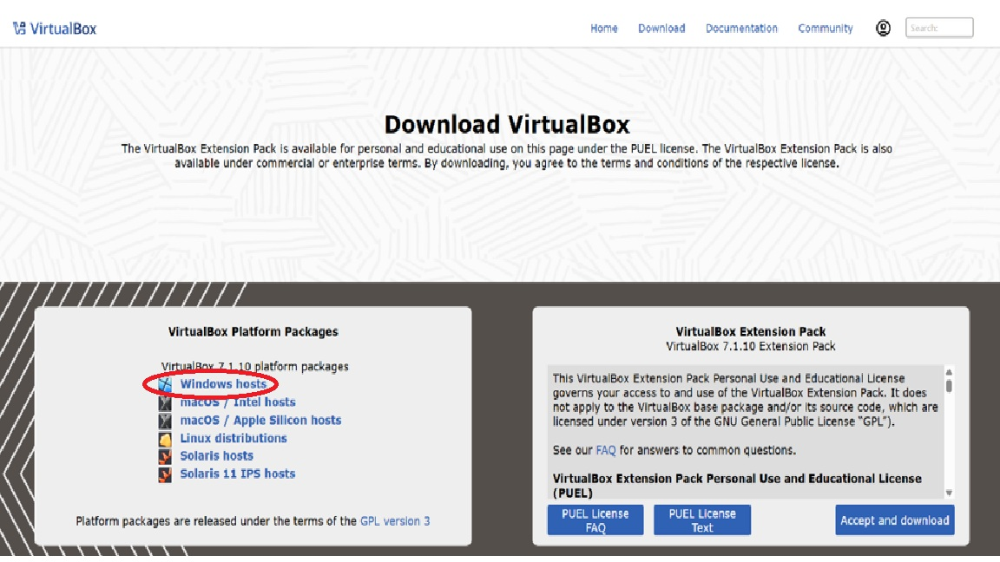
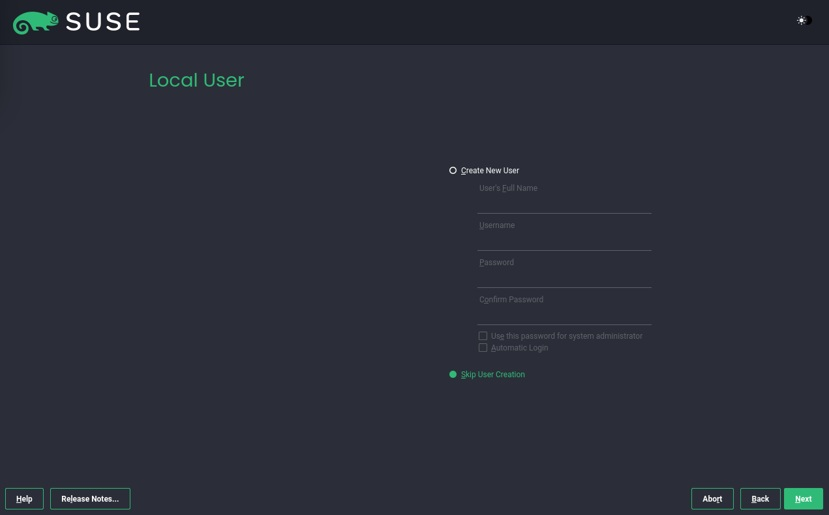

# SUSE 15 安裝示範

## 步驟 1：下載安裝檔

前往 SUSE 官網，下載對應硬體設備之安裝檔。

本次教學以下載15 SP7為例

接下來準備開始安裝虛擬機

---

## 步驟 2：安裝virtual box與建立VM

### 安裝virtual box

將SUSE安裝在VM之前我們必須在實體機器上創建一台VM

◎ 本次安裝VM設置為(CPUS：2 / RAM：4196MB / Disk：60GB)

本次選用Virtual Box來進行安裝

並依照電腦系統安裝正確的安裝包

然後直接打開安裝包

接下來三張圖直接點選下一步

接下來兩步皆點擊是

即可正式進入virtual box的介面

### 建立VM

點擊新增(N)

填寫此VM的基本資料

依照我們對VM的配置填入正確的設定

如此一來VM即設置完成

### 安裝SUSE

接下來要將SUSE系統裝入虛擬機內

在虛擬機上點擊設定並進入存儲裝置 點擊控制器:IDE 點擊空的

並在右側的光碟機choose a disk file

找出安裝的SUSE檔

便可以打開VM正式為其安裝SUSE

接下來只需要照著以下幾張圖片進行就可以

點選SUSE Linux Enterprise Sever 15 SP7

- 將映像掛載為 DVD 或寫入 USB 後重開機。
- 選擇 **Installation** 選項進入安裝流程。
- 安裝過程中若出現 "Validation Check Failed" 提示，選擇 **Yes**（可能需多次）。

---

## 步驟 3：網路設定與軟體源

- 可略過網路設定，但建議先掛入 **Packages ISO** 作為離線軟體源。
- 在 “Additional Product” 或 “Extensions & Modules” 階段選擇：

