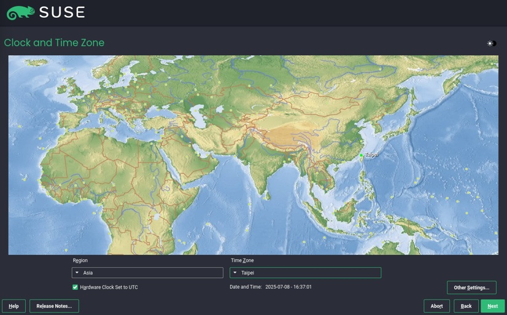
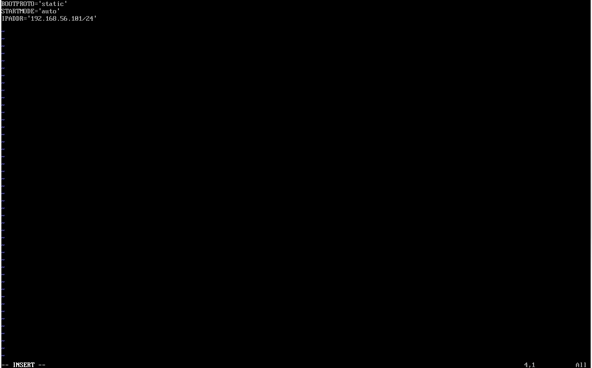

# SUSE 15 安裝示範

## 步驟 1：下載安裝檔

前往 SUSE 官網，下載對應硬體設備之安裝檔。

本次教學以下載15 SP7為例

接下來準備開始安裝虛擬機

---

## 步驟 2：安裝virtual box與建立VM

### 安裝virtual box

將SUSE安裝在VM之前我們必須在實體機器上創建一台VM

◎ 本次安裝VM設置為(CPUS：2 / RAM：4196MB / Disk：60GB)

本次選用Virtual Box來進行安裝

並依照電腦系統安裝正確的安裝包

然後直接打開安裝包

接下來三張圖直接點選下一步

接下來兩步皆點擊是

即可正式進入virtual box的介面

### 建立VM

點擊新增(N)

填寫此VM的基本資料

依照我們對VM的配置填入正確的設定

如此一來VM即設置完成

### 安裝SUSE

接下來要將SUSE系統裝入虛擬機內

在虛擬機上點擊設定並進入存儲裝置 點擊控制器:IDE 點擊空的

並在右側的光碟機choose a disk file

找出安裝的SUSE檔

便可以打開VM正式為其安裝SUSE

接下來只需要照著以下幾張圖片進行就可以

點選SUSE Linux Enterprise Sever 15 SP7

同意後點next

skip registration

自行選擇要不要額外裝設

next

minimal

expert partitioner----->start with correct proposal

將sda1-sda4全數刪除

照下列步驟自行設置

設置時區

skip the creation

設密碼

---

## 步驟 3：

# network
2-1 DHCP

打開 Yast→ 選擇 System → Network Settings

輸入指令確認有無連上網路

2-2 static IP

輸入vim /etc/sysconfig/network/ifcfg-eth0

調整內容

2-3 show ip, subnet mask, routing/gate way

查看 IP----->使用ip a

查看 gateway----->ip route

查詢Subnet Mask---->輸入ip addr

2-4 2 vm access each other

3.setup ssh server and access it

3-1 enable ssh server

照以下順序輸入指令

1.zypper in openssh   2.systemctl start sshd  3.systemctl enable sshd  4.systemctl status sshd

最後若出現Active: active (running) 這樣就代表你已成功啟動 SSH Server

3-2 setup firewall

依序輸入
1.firewall-cmd --permanent --add-service=ssh

2.firewall-cmd --reload

3.firewall-cmd --list-all

